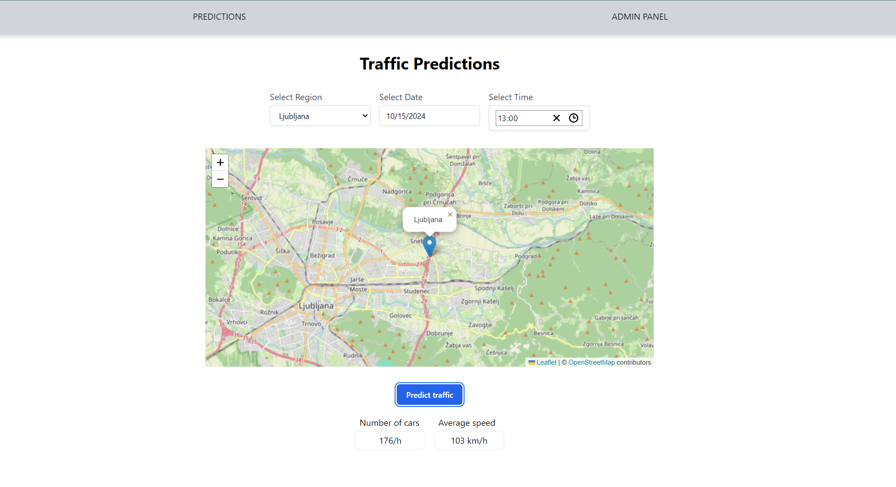

# INTRODUCTION
The following is a prediction system for traffic in (some parts of) Slovenia. It specifically predicts **average speed** and **number of cars per hour** for given date, time and region/location.  
It contains everything from scripts for data processing, data itself, data validation checkpoints, scripts for training and evaluating models, API that serves predictions and client that offers user interface for getting those predictions, and Dockerfile for both API and client.  

# SET UP & USE
*Precondition*: installed poetry in python environment & installed npm  
*Note*: values of .env variables aren't given here, since it's a security issue  
*Step 1 (root; python environment)*: **poetry install**  
*Step 2 (root)*: create **.env** file with the following variables  
  * NAP_USERNAME
  * NAP_PASSWORD
  * MLFLOW_TRACKING_USERNAME
  * MLFLOW_TRACKING_PASSWORD
  * MLFLOW_TRACKING_URI
  * MONGO_USERNAME
  * MONGO_PASSWORD  

*Step 3 (src/client)*: **npm install**  
*Step 4 (src/client)*: create **.env** file with the following variables 
 * REACT_APP_PREDICTION_API_URL=http://localhost:3001

*Step 5 (src/serve; python environment)*: **poetry run python pi.py** OR *(root; python environment)*: **docker build -t traffic_api .**  
*Step 6 (src/client)*: **npm run start** OR *(src/client)*: **docker build -t traffic_client .**  

# PROJECT CREATION STEPS
## Data validation 
**great_expectations init**  

**great_expectations datasource new**

What data would you like Great Expectations to connect to?  
 * 1. Files on a filesystem (for processing with Pandas or Spark)
 * 2. Relational database (SQL)  

**: 1**

What are you processing your files with?  
 * 1. Pandas
 * 2. PySpark

**: 1**

Enter the path of the root directory where the data files are stored. If files are on local disk enter a path relative to your current working directory or an absolute path.  
**: data/merged**

In datasource script, modify the following line to this:  
sanitize_yaml_and_save_datasource(context, example_yaml, **overwrite_existing=True**)

**great_expectations suite new**

How would you like to create your Expectation Suite?
 * 1. Manually, without interacting with a sample Batch of data (default)  
 * 2. Interactively, with a sample Batch of data  
 * 3. Automatically, using a Data Assistant  

**: 3**

A batch of data is required to edit the suite - let's help you to specify it.

Which data asset (accessible by data connector "default_inferred_data_connector_name") would you like to use?  
    1. Kozina_data.csv  
    2. Ljubljana_data.csv  
    3. Maribor_data.csv  
    4. Pomurska_data.csv  
    5. Postojna_data.csv  
    6. Sl_Konjice_data.csv  
    7. Vransko_data.csv  
    8. reference_data.csv  

Type [n] to see the next page or [p] for the previous. When you're ready to select an asset, enter the index.  
**: 8**

Name the new Expectation Suite [reference_data.csv.warning]: **trafficSuite**

exclude_column_names = [  
    "date",  
    "region",  
    "latitude",  
    "longitude",  
    # "day_of_week",  
    # "hour",  
    # "season",  
    # "fuel_price",  
    # "holiday",  
    # "temperature",  
    # "relative_humidity",  
    # "dew_point",  
    # "surface_pressure",  
    # "rain",  
    # "snowfall",  
    # "visibility",  
    # "num_of_cars",  
    # "avg_speed",  
]

To edit this suite run:  
great_expectations suite edit trafficSuite

**great_expectations checkpoint new trafficCheckpoint**

... data_asset_name: **Maribor_data.csv** ...

**great_expectations checkpoint script traffic_checkpoint_script**